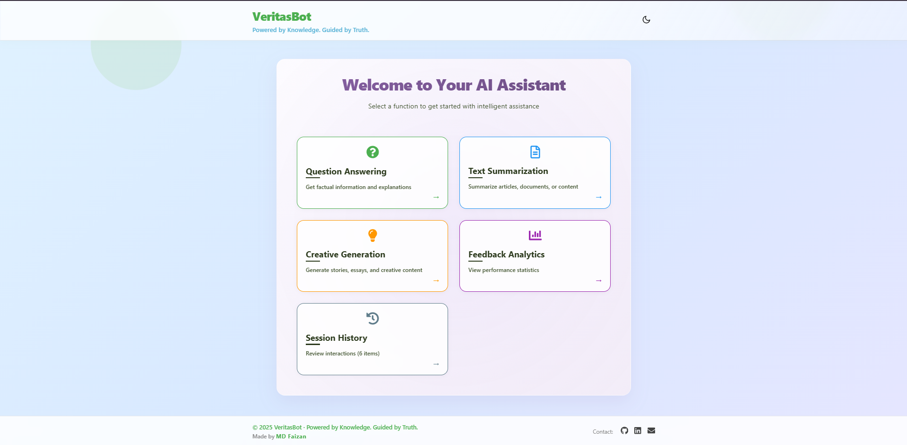

# VeritasBot: AI Assistant Platform

A modern, full-stack AI assistant web application with advanced NLP features, built using React (frontend) and Django (backend). Includes a CLI mode, feedback analytics, and a beautiful glassmorphism UI.

---

## 🚀 Features

- **Question Answering**: Multiple response styles (factual, analytical, educational)
- **Text Summarization**: Concise, bullet, and executive summaries
- **Creative Generation**: AI-powered content creation
- **Session History**: Track and revisit past interactions
- **Feedback Analytics**: Collect and analyze user feedback
- **Modern UI**: Glassmorphism, dark/light mode, responsive design
- **Secure**: Sensitive data protected, robust `.gitignore`
- **CLI Mode**: Command-line interface for power users

---

## 🛠️ Tech Stack

- **Frontend**: React, Framer Motion, CSS Modules
- **Backend**: Django, Django REST Framework
- **AI/NLP**: Google Generative AI, OpenAI, Transformers (configurable)
- **Database**: SQLite (default, easy to switch)
- **Other**: dotenv, feedback analytics

---

## 📁 Project Structure

```
├── ai-assistant-frontend/      # React app (UI)
├── ai-assistant-django-backend/ # Django backend (API, DB)
├── CLI mode/                  # Command-line interface
├── ai_assistant_env/          # Python virtual environment (ignored)
├── .gitignore                 # Sensitive files/folders excluded
├── README.md                  # Project documentation
```

---

## ⚡ Quick Start

### 1. Clone the Repository
```bash
git clone https://github.com/yourusername/veritasbot.git
cd veritasbot
```

### 2. Setup Python Backend
```bash
cd ai-assistant-django-backend
python -m venv ../ai_assistant_env
../ai_assistant_env/Scripts/activate  # Windows
pip install -r requirements.txt
python manage.py migrate
python manage.py runserver
```

### 3. Setup React Frontend
```bash
cd ../ai-assistant-frontend
npm install
npm start
```

### 4. (Optional) CLI Mode
```bash
cd ../CLI mode
python mainn.py
```

---

## 🔑 Environment Variables
- All secrets, API keys, and credentials must be set in `.env` files (see `.gitignore`).
- Example: `ai-assistant-django-backend/.env`, `CLI mode/.env`

---

## 🖼️ Screenshots

| Light Mode | Dark Mode |
|------------|-----------|
|  |  |

---

## 📊 Feedback & Analytics
- Users can submit feedback after each AI response.
- Admins can view feedback analytics in the dashboard.

---

## 🤝 Contributing
1. Fork the repo
2. Create a new branch (`git checkout -b feature/your-feature`)
3. Commit your changes (`git commit -am 'Add new feature'`)
4. Push to the branch (`git push origin feature/your-feature`)
5. Open a Pull Request

---

## 🛡️ Security & Best Practices
- All sensitive files are protected by `.gitignore`.
- Never commit `.env` or credential files.
- Review code before pushing to public repositories.

---

## 📄 License
This project is licensed under the MIT License.

---

## 👨‍💻 Author
- **MD Faizan**  
  [GitHub](https://github.com/Faiz-3112) • [LinkedIn](https://linkedin.com/in/md-faizan-81113031b)

---

## 🌐 Live Demo
> Coming soon!

---

## 💡 Inspiration
> "Powered by Knowledge. Guided by Truth."
